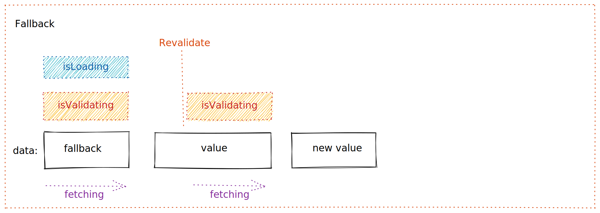

# Guide

import Video from 'components/video'
import { Bleed } from 'nextra-theme-docs'
import { Tabs } from 'nextra/components'
import { Callout } from 'nextra/components'

## Maths
The following features are configured via the Next.js configuration and are
available in all themes.


```latex
Variance ($\sigma^2$) = $np(1 - p)$
```
will be rendered as: 
$\sigma^2$ = $np(1 - p)$

## Quotes

<Bleed>
  <div style={{ border: '1px solid #888', padding: '4rem 2.5rem', textAlign: 'center' }}>
    _There is nothing to writing. All you do is sit down at a typewriter and **bleed**._

    — Ernest Hemingway

  </div>
</Bleed>

## YouTube Video 1

<Bleed>
  <iframe
    width="100%"
    height="430"
    src="https://youtube.com/embed/3hccXiXI0u8"
    allow="accelerometer; autoplay; clipboard-write; encrypted-media; gyroscope; picture-in-picture"
    allowFullScreen
  />
</Bleed>

## YouTube Video 2

<Bleed>
<iframe width="560" height="315" src="https://www.youtube.com/embed/C7dbEyH28Fg?si=34oi4tZHByR4oSwg" title="YouTube video player" frameborder="0" allow="accelerometer; autoplay; clipboard-write; encrypted-media; gyroscope; picture-in-picture; web-share" referrerpolicy="strict-origin-when-cross-origin" allowfullscreen></iframe>
</Bleed>

## YouTube Video 3

<Bleed>
<iframe
    width="100%"
    height="430"
    src="https://www.youtube.com/embed/C7dbEyH28Fg?si=34oi4tZHByR4oSwg"
    allow="accelerometer; autoplay; clipboard-write; encrypted-media; gyroscope; picture-in-picture"
    allowFullScreen
  />
</Bleed>

## Image 
<Bleed>
  
</Bleed>

You can even make it full-bleed using `<Bleed full>`:
## Image Full
<Bleed full>
  
</Bleed>


## Coding

```mdx filename="bleed.mdx"
<Bleed>Hey, I can use **Markdown** syntax here.</Bleed>

<Bleed full>
  
</Bleed>

<Bleed full>
  <iframe
    src="https://codesandbox.io/embed/swr-states-4une7"
    width="100%"
    height="500px"
    title="SWR-States"
  />
</Bleed>
```
## Tabs

<Tabs items={['JavaScript', 'C++', {label:'C', disabled: true}, 'Python']} defaultIndex={1}>
  <Tabs.Tab>
    ```js filename="hi.js"
    import { useState, useEffect } from 'react';
    ```
  </Tabs.Tab>

  <Tabs.Tab>
    ```cpp filename="hi.cpp"
    #include <iostream>
    ```
  </Tabs.Tab>

  <Tabs.Tab>
    ```c filename="hi.c"
    #include <stdio.h>
    ```
  </Tabs.Tab>

  <Tabs.Tab>
     ```python filename="hello.py"
    print('Hello, world!')
    ```
  </Tabs.Tab>
</Tabs>

## Highlight 1

<Callout>
  An example of the blog theme can be found
  [here](https://github.com/).
</Callout>


## SVG Images from web

This pattern is to fetch data and revalidate it later.


## SVG Image from File Storage

This pattern is to fetch data and change the key and revalidate it later.



## Emoji
<Callout emoji="📝">
  Fallback data and previous data are not considered "loaded data," so when you
  use fallback data or enable the keepPreviousData option, you might have data
  to display.
</Callout>

## GIF Images


## Video 

<Video
  src="https://user-images.githubusercontent.com/3676859/163695903-a3eb1259-180e-41e0-821e-21c320201194.mp4"
  ratio={640 / 730}
/>


## Video with Caption 

<Bleed>
  <Video
    src="https://media.istockphoto.com/id/1479135181/video/firework-with-audio.mp4?s=mp4-640x640-is&k=20&c=m_PN_5lsIh1oVrWz_siAQyMGOcbwRr9Kuv_JsHRw5x0="
    caption="Video: using focus revalidation to automatically sync login state between pages."
    ratio={640 / 730}
  />
</Bleed>


